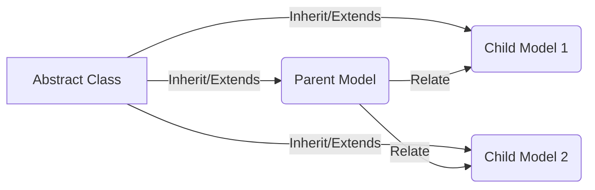

# Keditance Effect

```mermaid
graph LR
A[Abstract Class] -- Inherit/Extends --> B(Parent Model)
A -- Inherit/Extends --> C(Child Model 1)
A -- Inherit/Extends --> D(Child Model 2)

B --Relate--> C
B --Relate--> D

```
