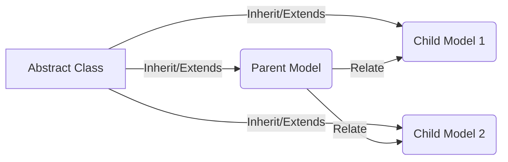

# Keditance Effect


```mermaid gantt
dateFormat  YYYY-MM-DD
title Adding GANTT diagram to mermaid

section A section
Completed task            :done,    des1, 2014-01-06,2014-01-08
Active task               :active,  des2, 2014-01-09, 3d
Future task               :         des3, after des2, 5d
Future task2               :         des4, after des3, 5d
```


```sequence {theme="hand"}
Andrew->China: Says Hello
Note right of China: China thinks\nabout it
China-->Andrew: How are you?
Andrew->>China: I am good thanks!
```


